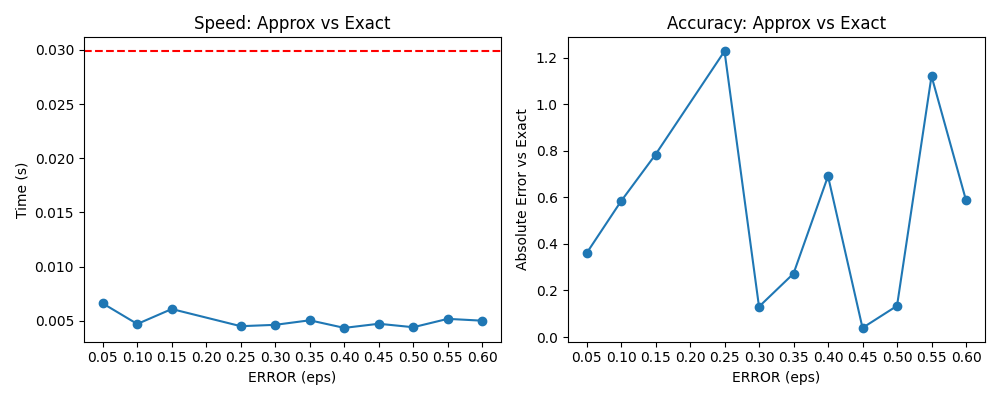
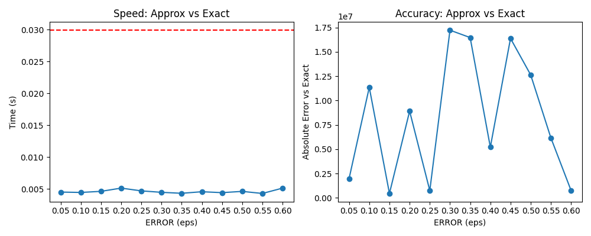
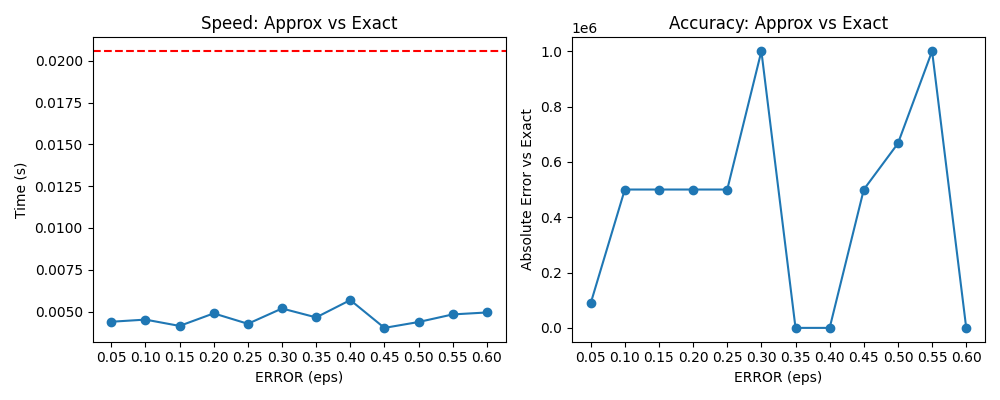

# QQL - QuickQueryLanguage

**QQL** (QuickQueryLanguage) is a simple interactive SQL shell built on top of PostgreSQL,
with support for query parsing, approximate query extensions, and pretty-printed results
directly in the terminal.

## Table of Contents
- [QQL - QuickQueryLanguage](#qql---quickquerylanguage)
  - [Table of Contents](#table-of-contents)
    - [Features](#features)
    - [Requirements](#requirements)
    - [Installation](#installation)
    - [Usage](#usage)
    - [Documentations](#documentations)
  - [Benchmarks](#benchmarks)
          - [Speed and accuracy trade-offs at different error thresholds](#speed-and-accuracy-trade-offs-at-different-error-thresholds)
    - [Examples](#examples)


### Features

- Interactive SQL shell (`qql>`)
- Connects to PostgreSQL using `psycopg2`
- Query parsing and rewriting powered by [`sqlglot`](https://github.com/tobymao/sqlglot)
- Pretty terminal tables using [`rich`](https://github.com/Textualize/rich)
- Environment variable support for saving credentials
- Click-based CLI for easy login

### Requirements

- Python **3.12+******
- [uv](https://github.com/astral-sh/uv) package manager (recommended)
- PostgreSQL server (local or remote)

---

### Installation

Clone the repo and install dependencies with uv:

```bash
git clone https://github.com/yourusername/qql.git
cd qql
uv sync
```

### Usage

```bash
uv run qql.py --username <db_user> --password <db_pass> --dbname <db_name> --host <db_host> --port <db_port>
```

If you omit parameters, **QQL** will prompt you interactively and save them for later sessions.
**Example:**

```bash
uv run qql.py --host=localhost --port=5432
```

---

### Documentations

| Keyword    | Where used                      | Meaning |
| ---------- | ------------------------------- | ------- |
| `APPROX` | Immediately before an aggregate |Request an offline approximate execution path (fast, uses synopses if available).|
|`ERROR <value>`|With aggregate / query|Target maximum relative error (e.g. 0.05 for 5%). Triggers online planning if used with CONFIDENCE|
|`CONFIDENCE <value>`|With aggregate / query|Target probability that the relative error is ≤ ERROR (e.g. 0.95 = 95%).| 

> ⚠️ **Important:** queries that use `DISTINCT` (including `COUNT(DISTINCT ...)`) will **always run exactly** in QQL by default. QQL will *not* apply approximate execution to `DISTINCT` results
---
## Benchmarks

###### Speed and accuracy trade-offs at different error thresholds

**Average Price Query**


**Sum Query**


**Count Query**


---

### Examples

Run a simple query:

```sql
qql> SELECT pizza_type, COUNT(*) FROM pizza_orders GROUP BY pizza_type;
```
